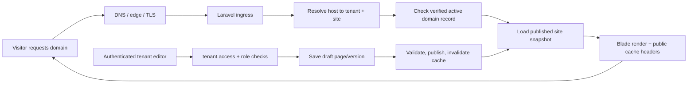

# Everbranch Website Builder Viability Report

Date: 2026-07-27

## Executive Conclusion

Viable, but requires substantial architectural work.

Everbranch already has a strong tenant-aware application shell, a brand system, public marketing pages, form primitives, and several draft/publish patterns. That is enough foundation for a constrained managed-website product. It is not enough for a full Wix- or Squarespace-style website builder and hosting platform yet.

The shortest honest path is a managed website module for small businesses, with a constrained section-based editor, server-rendered public pages, verified custom domains, and strong tenant isolation. A general-purpose drag-and-drop builder, custom-code hosting, and arbitrary site scripting would be a separate larger product.

## Current-State Findings

### 1) Tenant resolution and host handling already exist

Verified repository facts:

- Canonical host settings and legacy host handling are centralized in `config/tenancy.php:36`, `config/tenancy.php:60`, `config/tenancy.php:80`, and `config/tenancy.php:138`.
- Host-to-tenant resolution runs before auth in `app/Http/Middleware/ResolveHostTenantContext.php:18`.
- Pre-auth host routing can resolve landlord hosts, a slug subdomain, or a configured host map in `app/Services/Tenancy/PreAuthTenantContextResolver.php:16`.
- Authenticated tenant resolution still requires tenant membership and falls back carefully in `app/Services/Tenancy/AuthenticatedTenantContextResolver.php:17`.
- Tenant access is enforced on the server in `app/Http/Middleware/EnsureTenantAccess.php:22`.
- Canonical runtime hosts are explicitly enforced in `app/Http/Middleware/EnforceCanonicalRuntimeHost.php:14`.
- `app/Support/Tenancy/TenantHostBuilder.php:7` can generate `<slug>.<base-domain>` hosts and map specific slugs to explicit hosts.
- Session cookie domain handling is already base-domain aware in `config/session.php:6` and `app/Support/Tenancy/SessionCookieDomain.php:7`.

What this means:

- Everbranch already knows how to resolve a tenant from a host.
- That host is not the security boundary; membership and route protection still matter.
- Current host mapping is deployment-time and env-driven, not customer-managed.

### 2) Public surfaces exist, but they are not a website CMS

Verified repository facts:

- Public marketing pages live in Blade views such as `resources/views/platform/promo.blade.php:1`, `resources/views/platform/contact.blade.php:1`, and `resources/views/evergrove/home.blade.php:1`.
- `app/Http/Controllers/PlatformProductPagesController.php:12` serves promo, contact, plans, demo, start, and catalog feed pages.
- `app/Http/Controllers/EvergroveServicesController.php:11` serves the Evergrove public site and tools.
- Public class signup pages already use tenant slugs in URLs in `app/Http/Controllers/PublicClassSignupController.php:22` and `resources/views/class-scheduling/public-index.blade.php:1`.
- Some tenant experiences already expose public-safe pages with publish-like behavior, for example `resources/views/class-scheduling/index.blade.php:8` and `resources/views/class-scheduling/show.blade.php:1`.

What this means:

- The repo already has public-facing tenant experiences.
- Those experiences are app features and marketing pages, not a reusable site/page engine.

### 3) Branding is already tenant-scoped

Verified repository facts:

- Tenant branding lives in `app/Models/TenantBrandProfile.php:9` and `database/migrations/2026_07_20_180000_create_tenant_branding_profiles_and_assets.php:12`.
- Brand assets are stored in `app/Models/TenantBrandAsset.php:8` and created in `database/migrations/2026_07_20_180000_create_tenant_branding_profiles_and_assets.php:35`.
- The brand service enforces contrast and safe theme tokens in `app/Services/Tenancy/TenantBrandProfileService.php:13`.
- Brand customization is already editable in `app/Http/Controllers/TenantBrandController.php:16` and `resources/views/tenant-branding/edit.blade.php:21`.

What this means:

- The platform already has the beginnings of per-tenant theme tokens, logos, and asset management.
- It still lacks site-level theme/token separation, page templates, and public site publishing.

### 4) There is a limited content model, but not a site/page model

Verified repository facts:

- Tenant-scoped forms exist in `app/Models/TenantForm.php:10`, `app/Models/FormSubmission.php:9`, `database/migrations/2026_06_29_180000_create_forms_tables.php:11`, and `config/forms.php:3`.
- The form provisioning service already has a template-and-default-form pattern in `app/Services/Forms/TenantFormProvisioningService.php:12`.
- Discovery metadata already exists in `app/Models/TenantDiscoveryProfile.php:9`, `app/Models/TenantDiscoveryPage.php:9`, and `app/Services/Discovery/TenantDiscoveryProfileService.php:27`.
- Discovery data already includes domain relationships and page metadata in `app/Services/Discovery/TenantDiscoveryProfileService.php:233` and `app/Services/Discovery/TenantDiscoveryProfileService.php:603`.
- The discovery resolver can map page types to canonical URLs in `app/Services/Discovery/DomainCanonicalResolver.php:16`.

What is missing:

- No dedicated `tenant_sites`, `site_pages`, `site_page_versions`, `site_domains`, `site_redirects`, `site_navigation`, or `site_blocks` tables were found.
- No dedicated page builder/editor, publish queue, or domain verification workflow exists in the repository.

### 5) Draft/publish patterns already exist elsewhere and are reusable

Verified repository facts:

- `app/Services/Shopify/ShopifyAppContentService.php:15` stores separate draft and published snapshots.
- `resources/views/shopify/edit-app.blade.php:585` exposes save draft and publish live controls.
- `app/Models/AutomationWorkflowVersion.php:9` stores immutable published workflow versions.
- `app/Models/AutomationWorkflowRunItem.php:10` stores durable, version-pinned run items with encrypted payloads.

What this means:

- Everbranch already understands the concept of editable draft state and immutable published state.
- That pattern can be reused for a website module instead of inventing it from scratch.

### 6) Deployment and runtime assumptions are Forge- and host-centric

Verified repository facts:

- Production deployment is documented around Forge atomic releases in `docs/operations/forge-atomic-release-runbook.md:5`.
- Canonical host cutover and Cloudflare edge redirects are documented in `docs/operations/domain-cutover-everbranch-runbook.md:3`.
- `docs/operations/domain-cutover-everbranch-runbook.md:51` expects wildcard tenant host coverage, cert issuance, and edge redirects.
- `config/filesystems.php:18` uses local/public/S3 disks with public file serving through Laravel.
- `config/cache.php:18` defaults to the database cache store.
- `config/queue.php:16` defaults to the database queue.
- `config/database.php:19` defaults to sqlite locally and MySQL in deployed environments.
- `config/session.php:141` and `config/session.php:170` show session cookies are designed around a canonical base domain.

What this means:

- The current production model is fine for the core app and for a small number of public tenants.
- It does not yet include a customer-domain hosting control plane.

### 7) No hosting-specific OpenAI config was present

Verified repository facts:

- I searched for `.openai/hosting.json` and did not find one.

What this means:

- There is no repo-local Sites hosting configuration to reuse here.

## Gap Analysis

| Capability | What exists now | What is missing | Risk | Recommended approach | Estimated effort |
|---|---|---|---|---|---|
| Custom domains | Canonical subdomain and host resolution exist via `config/tenancy.php`, `TenantHostBuilder`, and host middleware. | Domain ownership records, verification, status lifecycle, apex/www handling, redirects, per-domain TLS. | High, because a host mismatch can expose the wrong tenant or break login. | Use a DB-backed domain registry and an external edge/TLS provider. Cloudflare for SaaS/custom hostnames is the safest practical fit. | 80-140 hours |
| SSL and certificate lifecycle | Canonical host TLS assumptions exist in docs. | Automated issuance/renewal/revocation per customer domain. | High. Manual cert management will not scale. | Offload TLS to Cloudflare custom hostnames if possible; otherwise automate ACME very carefully. | 40-100 hours |
| Site/page content model | Tenant branding, discovery pages, forms, and workflow versioning already exist. | Dedicated site, page, version, block, menu, redirect, and SEO tables. | High, because ad hoc content will become unmaintainable. | Add a purpose-built site CMS model and keep discovery metadata separate. | 120-200 hours |
| Builder/editor | There is brand editing and several structured forms. | Real page editor, block picker, draft preview, publish, rollback, mobile editing. | High if a freeform builder is attempted too early. | Start with constrained sections/blocks and server-rendered preview. | 80-160 hours |
| Rendering/runtime | Public pages are Blade-rendered today. | Tenant site renderer, preview mode, published snapshot cache, host-aware public routing. | Medium-high. | Stay with Blade/server rendering for public pages; keep admin editor separate. | 40-90 hours |
| Navigation and IA | App navigation exists for the product shell. | Site navigation menus and per-page nav ordering. | Medium. | Add site navigation models tied to published versions. | 30-60 hours |
| Forms and lead capture | Tenant forms and submissions already exist. | Site form blocks, spam controls, routing into submissions, confirmation pages. | Medium. | Reuse existing form tables and add site-facing wrappers. | 30-70 hours |
| Media/assets | Tenant brand assets and public storage exist. | Public site media library, per-site media permissions, image resizing, CDN strategy. | Medium. | Reuse tenant assets with site-scoped media metadata. | 30-80 hours |
| SEO and redirects | Discovery pages already track canonical URLs and meta descriptions. | Title/description editor, Open Graph, canonical URL rules, redirect manager. | Medium. | Make SEO a first-class page attribute and publish-time validation. | 30-70 hours |
| Operations/security | Tenant auth, queue, cache, and storage are already mature. | CSP policy, rate limiting for public forms, abuse review, content sanitization, domain troubleshooting, deletion/retention policy. | High. | Add a site ops checklist, logging, moderation, and spam protections before launch. | 60-120 hours |
| Commerce handoff | Shopify-aware app content and module catalog already exist. | Clear website-to-checkout handoff and non-Shopify CTA conventions. | Medium. | Keep Shopify/Stripe checkout external; website module should hand off, not replace. | 20-50 hours |

## Recommended MVP

The smallest version worth selling is not a generic website builder. It is a managed website module for small businesses with a constrained set of page types and blocks.

Recommended v1:

- One public site per tenant.
- One canonical Everbranch subdomain, `https://<tenant-slug>.theeverbranch.com`.
- Optional custom domain connection, starting with `www.customerbusiness.com` and apex support.
- A small set of pages: Home, About, Services, Contact, FAQ, and a simple landing page type.
- A structured section/block editor, not a freeform drag-and-drop canvas.
- Theme tokens from the existing brand profile: logo, colors, typography, corner style, decor preset.
- Navigation editing with primary and footer menus.
- SEO fields per page: title, description, canonical path, social preview image.
- Forms that reuse the existing tenant form/submission stack.
- Media uploads tied to tenant ownership.
- Draft, preview, publish, and rollback.
- Basic analytics: visits, clicks, form submissions, and domain health.
- Shopify or external checkout links as CTAs where relevant.

What v1 should explicitly exclude:

- Arbitrary HTML/CSS or custom JavaScript hosting.
- Multi-step drag-and-drop layout freedom.
- Blogging, comments, memberships, and localization.
- Full ecommerce catalog, payments, tax, inventory, and fulfillment.
- A full Wix/Squarespace-style app marketplace.

## Architecture Recommendation

The best fit for the current codebase is:

- Server-rendered public sites with Blade.
- A constrained editor in the admin app, likely Livewire or React where needed.
- A versioned publish model with cached published snapshots.
- A verified domain registry in the database.
- Edge TLS/custom hostnames handled by a SaaS edge provider rather than trying to make Forge do everything by itself.

### Proposed request flow

### Recommended tables and models

Reuse where possible:

- `tenants` - existing owner record.
- `tenant_brand_profiles` and `tenant_brand_assets` - existing brand layer.
- `tenant_forms` and `form_submissions` - existing lead capture.

Add for the site module:

- `tenant_sites`
- `tenant_site_domains`
- `tenant_site_pages`
- `tenant_site_page_versions`
- `tenant_site_navigation_menus`
- `tenant_site_navigation_items`
- `tenant_site_blocks`
- `tenant_site_media_assets`
- `tenant_site_redirects`
- `tenant_site_publish_events`

Suggested responsibilities:

- `tenant_sites` owns the website configuration for a tenant.
- `tenant_site_domains` stores verified hosts, primary-domain status, redirect behavior, and TLS/edge state.
- `tenant_site_pages` stores the latest editable record and the current published version pointer.
- `tenant_site_page_versions` stores immutable snapshots for draft and published history.
- `tenant_site_blocks` stores structured sections and their ordered content.
- `tenant_site_navigation_*` stores menus and navigation items.
- `tenant_site_redirects` stores path redirects and canonicalization rules.
- `tenant_site_media_assets` stores page-level media references and usage.

### Services and jobs

Likely new services:

- `TenantSiteDomainService`
- `TenantSitePublishService`
- `TenantSiteRenderer`
- `TenantSiteEditorService`
- `TenantSiteSeoService`
- `TenantSiteMediaService`
- `TenantSiteRedirectService`

Likely new jobs:

- `VerifyTenantSiteDomainJob`
- `IssueTenantSiteCertificateJob`
- `PublishTenantSiteSnapshotJob`
- `InvalidateTenantSiteCacheJob`
- `ReconcileTenantSiteDomainHealthJob`

### Domain verification and activation lifecycle

1. Tenant adds a domain.
2. System creates a pending domain row and a verification token.
3. Tenant publishes a DNS record or completes edge-provider verification.
4. A job confirms ownership and marks the domain verified.
5. The domain becomes activatable only after it is verified and mapped to one tenant/site.
6. Primary domain selection sets the canonical host.
7. Alternate domains 301 to the primary host if configured.
8. If verification fails repeatedly or the domain is removed, the site is paused or the domain is suspended cleanly.

### Publishing lifecycle

1. Tenant edits a draft page or block.
2. Draft saves create a new version row or bump a draft revision.
3. Publish validates required sections, asset references, SEO fields, and domain readiness.
4. Publish writes an immutable published version and updates the published pointer.
5. Public requests only read the published snapshot.
6. Rollback is a pointer change, not a destructive rewrite.

### Caching strategy

- Cache the rendered published snapshot by tenant, domain, page path, and published version.
- Invalidate on publish, domain changes, and navigation changes.
- Allow public HTML caching on published pages.
- Keep editor and preview responses uncacheable.
- If an edge CDN is available, let it cache public HTML and images aggressively while the origin stays authoritative.

### Security boundaries

- Host is a lookup key, not authorization.
- Every authenticated mutation still requires tenant membership and role checks.
- Public site requests may resolve a tenant from host, but never assume that implies edit or admin access.
- Custom scripts should be excluded in v1.
- Forms should be rate-limited and spam-protected.
- Media uploads must remain tenant-scoped and sanitized.
- Unknown or unverified hosts should fail closed.

## Delivery Roadmap

| Phase | Goal | Main files likely affected | Database changes | Tests required | Dependencies | Risks | Definition of done |
|---|---|---|---|---|---|---|---|
| 1. Investigation and prerequisites | Confirm the tenant/site contract and freeze scope. | `config/tenancy.php`, `app/Services/Tenancy/*`, `docs/architecture/*`, `docs/operations/*` | None or read-only audit seeds | Tenant boundary tests, host resolution tests, smoke on canonical hosts | None | Scope creep into full CMS | Written spec, verified host matrix, clear MVP scope |
| 2. Public site runtime | Add a read-only public renderer for a tenant site. | `routes/web.php`, new public controllers/services, Blade views, middleware | `tenant_sites`, `tenant_site_domains`, `tenant_site_pages` | Public host resolution, unknown-host 404, tenant isolation, cache behavior | Phase 1 | Cross-tenant exposure via host mistakes | A tenant page renders on a slug subdomain and fails closed elsewhere |
| 3. Content and template system | Add pages, versions, blocks, menus, SEO, and redirects. | new site models/migrations, editor services, public renderers | `tenant_site_page_versions`, `tenant_site_blocks`, `tenant_site_navigation_*`, `tenant_site_redirects` | Draft save, publish, rollback, canonical URL, redirect tests | Phase 2 | Data model bloat | Pages and menu content can be drafted, published, and rolled back |
| 4. Editor | Give tenants a usable block-based editor and preview. | new admin views/components, maybe `resources/js/site-editor/*` | draft metadata columns, revision fields | Playwright journeys, keyboard nav, reduced-motion, preview screenshots | Phase 3 | Overbuilding into a drag-and-drop product | Tenants can edit blocks, preview, and publish from one screen |
| 5. Media, forms, and SEO | Make the site operationally useful. | form controllers/services, media services, SEO helpers, upload endpoints | `tenant_site_media_assets`, form references | Spam/rate-limit tests, form submission tests, SEO metadata tests | Phase 3 | Spam and media leakage | Public forms work, media is tenant-scoped, SEO fields render correctly |
| 6. Custom domains and SSL | Support apex, `www`, and custom domains with verification and HTTPS. | domain services, host middleware, deployment/ops docs, perhaps edge config | `tenant_site_domains` with verification/TLS status | Domain verification, takeover prevention, alternate-domain redirect tests | Phase 2 and 3 | TLS/cert lifecycle and domain support burden | Customer domains activate safely and serve over HTTPS |
| 7. Publishing and caching | Make publishes fast, safe, and reversible. | publish service, cache invalidation, queue jobs | publish events/snapshots | Publish gate, rollback, stale cache, background job tests | Phase 3 | Stale content or partial publish | Publish changes the live site atomically and can be rolled back |
| 8. Shopify/module integration | Keep commerce handoff intentional, not rebuilt. | site CTAs, module catalog, checkout link helpers | optional CTA metadata only | External checkout link tests, module visibility tests | Phase 2-7 | Scope creep into ecommerce | Site pages can link to Shopify/Stripe/external flows cleanly |
| 9. Operations, monitoring, and billing readiness | Make it supportable and sellable. | readiness docs, ops runbooks, logging, analytics, billing surfaces | audit events, retention state, site health | Staging smoke, uptime/readiness, backup/restore, abuse checks | All prior phases | Support load and hidden operational cost | Production readiness documented and support procedures exist |

## Effort Estimate

Assumption: this is for the recommended managed-website MVP, not a full general-purpose Wix clone.

| Scenario | Engineering hours | Codex-assisted calendar time | Human review/testing time | Operational setup time |
|---|---|---|---|---|
| Low | 220-300 | 2-3 weeks | 20-30 hours | 8-12 hours |
| Expected | 360-520 | 4-7 weeks | 35-50 hours | 12-20 hours |
| High | 700-900 | 8-12 weeks | 60-90 hours | 20-40 hours |

Biggest sources of uncertainty:

- Whether custom domains are handled by Cloudflare for SaaS/custom hostnames or by origin-side certificate automation.
- How much editing freedom is actually required.
- How far SEO, redirects, and preview/rollback need to go at v1.
- Whether customer support becomes managed-service heavy or stays mostly self-serve.

If the goal is true Wix-like generality, the effort is materially larger than the MVP range above.

## Final Recommendation

### Can Everbranch realistically do this?

Yes, but only as a constrained managed website system, not as a full general-purpose builder on day one.

### Should it?

Yes, if the target is small businesses that already benefit from Everbranch operations, forms, workflows, and branded tenant experiences. No, if the goal is to compete head-on with Wix or Squarespace on open-ended design freedom.

### What should version one include?

- One tenant site.
- A small set of pages and blocks.
- Brand tokens from the existing brand system.
- Navigation, SEO, forms, media, and publish/preview/rollback.
- `https://<tenant-slug>.theeverbranch.com`.
- Optional custom domain connect.
- HTTPS and a safe domain activation flow.
- Basic analytics.
- External checkout handoff links when needed.

### What should version one exclude?

- Arbitrary code.
- Freeform drag-and-drop layout.
- Blogging and content marketing CMS depth.
- Native ecommerce checkout.
- Multi-site tenancy.
- Plugin ecosystems.

### Should it be marketed as a website builder, managed websites, or an Everbranch website module?

Market it as managed websites or an Everbranch website module. Do not market v1 as a full website builder unless the product actually gains the flexibility, templates, integrations, and support model that label implies.

### What is the first implementation PR after the investigation?

The first PR should add the site/domain foundation and a read-only public runtime behind a feature flag:

- `tenant_sites`
- `tenant_site_domains`
- host verification and resolution
- a simple Blade-rendered public site for `<tenant-slug>.theeverbranch.com`
- a publish pointer or snapshot table
- tests for tenant isolation and unknown-host failure

That PR gives you the host-to-site backbone before you build the editor.

## Evidence Index

Useful repo evidence for follow-up work:

- Host and tenant resolution: `config/tenancy.php:36`, `app/Services/Tenancy/PreAuthTenantContextResolver.php:16`, `app/Http/Middleware/ResolveHostTenantContext.php:18`, `app/Http/Middleware/EnsureTenantAccess.php:22`.
- Canonical runtime host enforcement: `app/Http/Middleware/EnforceCanonicalRuntimeHost.php:14`.
- Public pages and marketing shell: `resources/views/platform/promo.blade.php:1`, `resources/views/platform/contact.blade.php:1`, `resources/views/evergrove/home.blade.php:1`, `app/Http/Controllers/PlatformProductPagesController.php:12`.
- Brand/theme foundation: `app/Models/TenantBrandProfile.php:9`, `app/Services/Tenancy/TenantBrandProfileService.php:13`.
- Discovery metadata: `app/Models/TenantDiscoveryProfile.php:9`, `app/Models/TenantDiscoveryPage.php:9`, `app/Services/Discovery/TenantDiscoveryProfileService.php:27`.
- Forms: `config/forms.php:4`, `app/Models/TenantForm.php:10`, `app/Models/FormSubmission.php:9`, `app/Services/Forms/TenantFormProvisioningService.php:12`.
- Draft/publish patterns: `app/Services/Shopify/ShopifyAppContentService.php:15`, `resources/views/shopify/edit-app.blade.php:585`, `app/Models/AutomationWorkflowVersion.php:9`.
- Runtime and ops assumptions: `config/session.php:6`, `config/filesystems.php:18`, `config/cache.php:18`, `config/queue.php:16`, `docs/operations/domain-cutover-everbranch-runbook.md:3`, `docs/operations/forge-atomic-release-runbook.md:5`.

